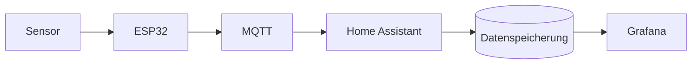

# Systemarchitektur

## 1. Übersicht

Beschreibt Aufbau und Funktionsweise eures Systems.

## 2. Blockdiagramm

Erstellt ein übersichtliches Blockdiagramm. Mermaid kann direkt in GitHub-Markdown verwendet werden.

Passt das Diagramm an euer tatsächliches System an.

## 3. Hardware

| Komponente | Aufgabe | Schnittstelle |
|---|---|---|
| ESP32 | zentrale Verarbeitung | |
| | | |

## 4. Softwarekomponenten

Beschreibt die wichtigsten Softwaremodule und ihre Verantwortlichkeiten.

## 5. Klassenmodell

Dokumentiert Klassen, wichtige Attribute/Methoden und Beziehungen. Auch hierfür kann Mermaid verwendet werden.

## 6. Datenstrukturen und Algorithmen

Welche Datenstrukturen werden verwendet? Warum wurden sie gewählt?

Welche Algorithmen verarbeiten die Prozessdaten?

## 7. Datenfluss

Beschreibt den Weg der Daten vom Sensor bis zur Visualisierung und gegebenenfalls zurück zum Aktor.

## 8. Aufgabenverteilung im System

### Mikrocontroller

- ...

### Home Assistant / Server

- ...

### Grafana

- ...
